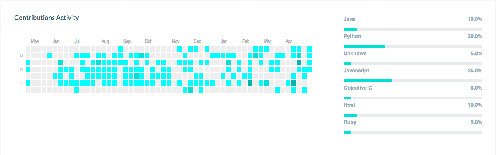
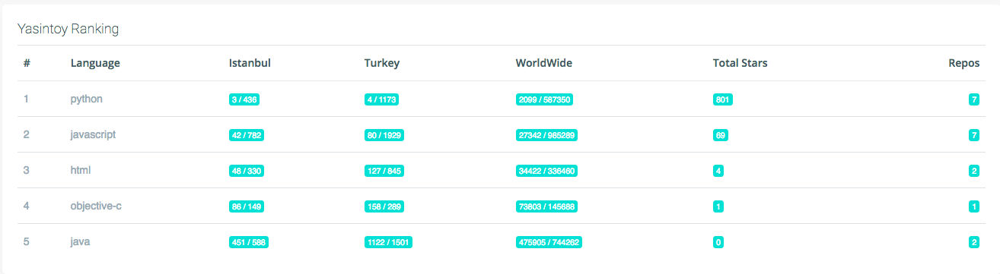
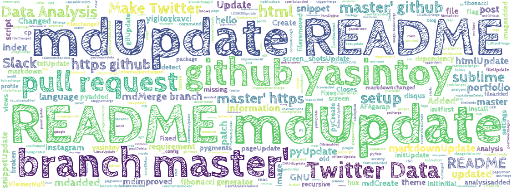

# 

Alize
=================
> *Visualize your GitHub profile and use in your CV. I'll add pdf export feature as soon as*
> *Currently working demo is on*
> [alize.me](http://alize.me)

# 

## Table of Contents
- [Installation](#installation)
- [Getting Started](#getting-started)
- [Features](#features)
- [TODO](#todo)
- [Contributing](#contributing)
- [License](#license)

## Installation

Before start, you should install redis.

** Install Redis **
```
[Follow this steps](https://medium.com/@petehouston/install-and-config-redis-on-mac-os-x-via-homebrew-eb8df9a4f298)
```
**For Mac/Linux :**
```
git clone https://github.com/yasintoy/Alize.git
cd Alize
virtualenv env -p python2
source env/bin/active
cd alize
pip install -r requirements.txt

```

When the installation completes, add your [GitHub Token](https://api.slack.com/docs/oauth-test-tokens) to `export TOKEN = '<enter your github token here>`.

## Getting Started

Before start, you have to start redis server in a new tab `redis-server` </br>
and then run the project with `python manage.py runserver`

```
$(in a new tab) redis-server
$(in main tab) python manage.py runserver
```

### Profile Tab

#### 

### Profile Infos
#### 

### Contributions Activity and percentage of per repo languages 

#### 

### World, Country and City Ranking
#### 

###  Recent Commits
#### 

- Most Used Words In Commit Messages
#### 

## TODO

* PDF export


## Contributing 
- Fork the repo
- Branch it in your development environment (this is required if only you are willing to contribute frequently)
- Hack in
- Make a pull request
- Chill

## LICENCE

MIT License

Copyright (c) 2018 Yasin Toy

Permission is hereby granted, free of charge, to any person obtaining a copy of this software and associated documentation files (the "Software"), to deal in the Software without restriction, including without limitation the rights to use, copy, modify, merge, publish, distribute, sublicense, and/or sell copies of the Software, and to permit persons to whom the Software is furnished to do so, subject to the following conditions:

The above copyright notice and this permission notice shall be included in all copies or substantial portions of the Software.

THE SOFTWARE IS PROVIDED "AS IS", WITHOUT WARRANTY OF ANY KIND, EXPRESS OR IMPLIED, INCLUDING BUT NOT LIMITED TO THE WARRANTIES OF MERCHANTABILITY, FITNESS FOR A PARTICULAR PURPOSE AND NONINFRINGEMENT. IN NO EVENT SHALL THE AUTHORS OR COPYRIGHT HOLDERS BE LIABLE FOR ANY CLAIM, DAMAGES OR OTHER LIABILITY, WHETHER IN AN ACTION OF CONTRACT, TORT OR OTHERWISE, ARISING FROM, OUT OF OR IN CONNECTION WITH THE SOFTWARE OR THE USE OR OTHER DEALINGS IN THE SOFTWARE.
